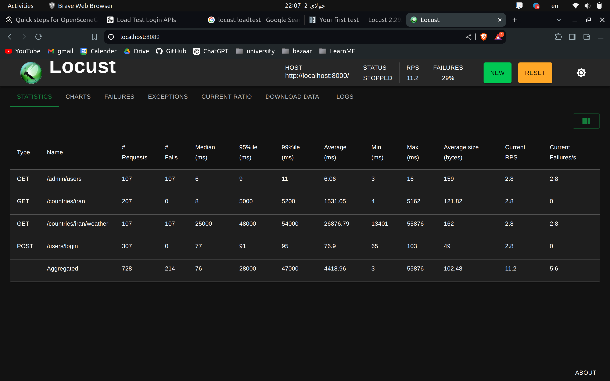
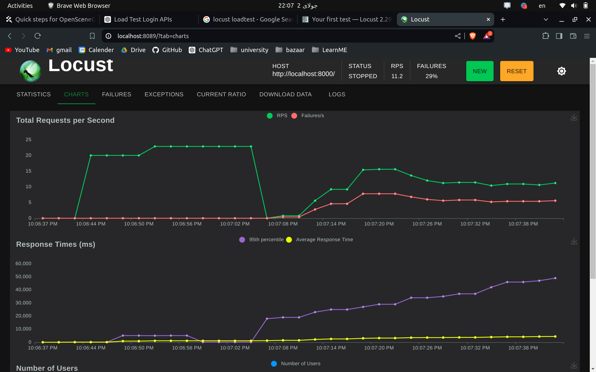
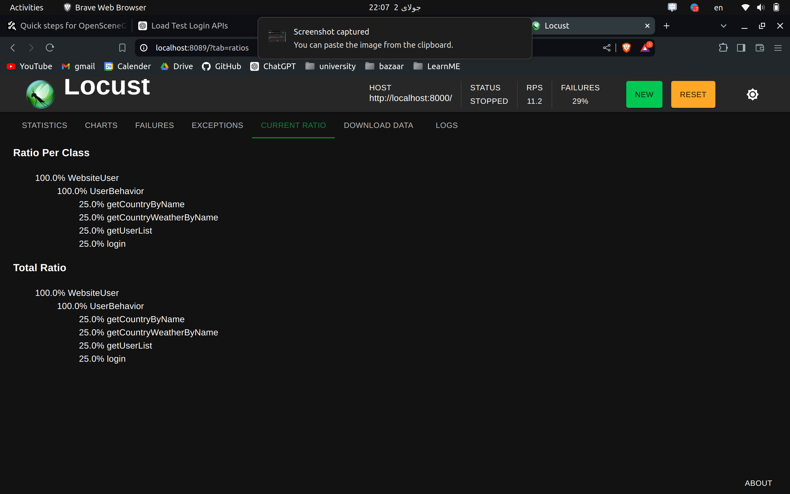

# RUN

For running loadtest run this command:


```
locust -f loadtest.py --host=http://localhost:8000/ --users 100 --spawn-rate 10

```

# Results

we run the loadtest an you can see results:

results:


charts:


rate:



